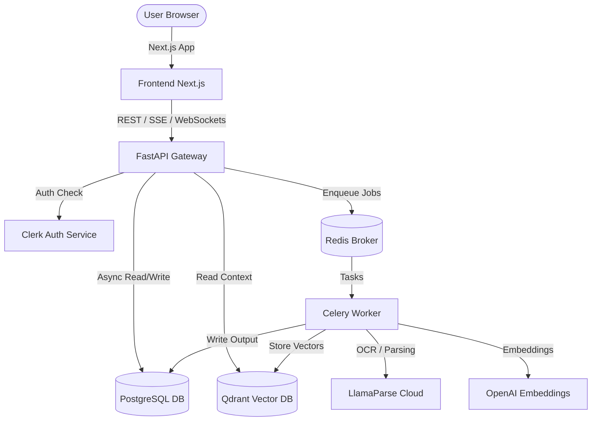

# SYSTEM ARCHITECTURE: VentureLens AI

VentureLens AI is built using an asynchronous, event-driven architecture designed to handle large-scale financial document ingestion, multi-agent AI analysis, and real-time portfolio intelligence.

---

## 1. System Overview

- **Frontend (Next.js)**: A single-page application built on Next.js 16 (App Router) and styled with TailwindCSS and custom CSS. Uses `@clerk/nextjs` for authentication and `@tanstack/react-query` for server state caching.
- **Backend Gateway (FastAPI)**: Lightweight ASGI service handling incoming routes, validation, rate limiting, and SSE chat streams.
- **Background Worker (Celery)**: Standard Python threads that execute CPU-heavy document parsing, OCR tables extraction, and vectorization.
- **Database Layer**:
  - **PostgreSQL**: Stores fully normalized relational data (e.g., users, organizations, cap tables, deals, timelines, tasks).
  - **Qdrant**: High-performance vector database utilized for semantic chunk retrieval.
- **Caching & Broker (Redis)**: Serves as the message broker for Celery tasks and the rate-limiter backend for SlowAPI.

---

## 2. Ingestion & RAG Data Flow

### Document Ingestion Flow
1. **Upload**: User uploads a Pitch Deck or Financial Sheet (PDF/XLSX) in the frontend.
2. **Storage**: The gateway receives the multipart form, saves it locally (or S3), and records a database record with status `"Uploaded"`.
3. **Queue**: The gateway triggers a Celery task `parse_document_task` and returns a `202 Accepted` response.
4. **Parse**: The Celery worker downloads the file, calls **LlamaParse** (or offline fallback) to extract plain text and Markdown tables, and updates status to `"Processing"`.
5. **Embedding**: The worker splits the text using LangChain's `RecursiveCharacterTextSplitter` into 1000-character chunks and embeds them via OpenAI Embeddings (1536-dim).
6. **Indexing**: The embeddings are pushed to the Qdrant vector database under the collection `venturelens_docs` with payload metadata (e.g., `tenant_id`, `document_id`).
7. **Complete**: The worker updates the database record status to `"Completed"` and publishes a WebSocket event to notify the frontend.

### Chat Copilot RAG Flow
1. **Query**: The user types a question in the chat widget (e.g., "Estimate QuantumDB runway").
2. **Embed**: The backend generates a query embedding.
3. **Retrieve**: Search Qdrant for matching chunks, applying a strict filter on `tenant_id` to ensure user organization privacy.
4. **LLM Chain**: The retrieved text chunks are assembled into a context prompt.
5. **Stream**: The gateway sends the prompt to the selected LLM provider (Gemini, Claude, or GPT) and yields the SSE tokens back to the user's browser.

---

## 3. Tenant Isolation & Security
- **Data Privacy**: Multi-tenancy is enforced at the database level by partitioning queries on `organization_id` and at the vector search level by adding a `must` filter on `tenant_id` within Qdrant searches.
- **Role-Based Access Control**:
  - `Admin`: Full permissions including user management and system settings.
  - `Partner` / `Associate`: Can execute deal flows, generate memos, and modify portfolio projections.
  - `Analyst`: Can upload documents, run cap table sims, and manage tasks.
  - `Viewer`: Read-only access to dashboards, reports, and charts.
