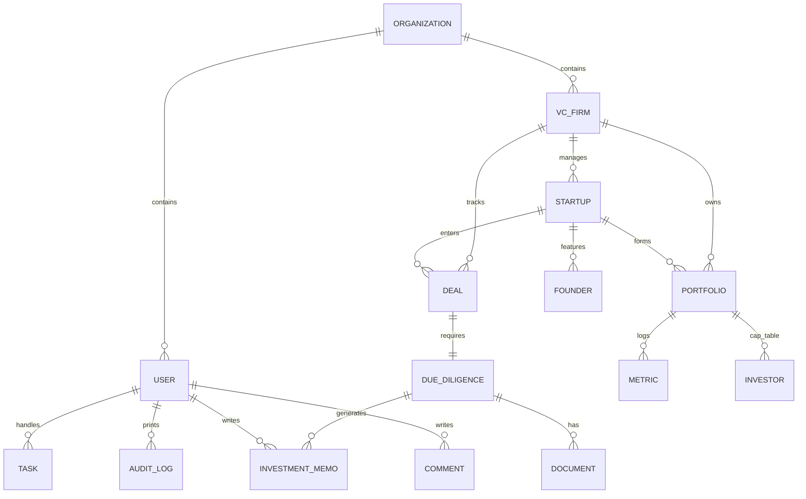

# DATABASE SCHEMA: VentureLens AI

VentureLens AI stores transaction state, tenant metrics, pipeline logs, and analytics across a normalized PostgreSQL relational database. This document specifies all 20+ core database schemas.

---

## 1. Relational Entity Schema

---

## 2. Core Tables Definitions

### `organizations`
- `id` (VARCHAR(36), PK): UUID of the parent tenant.
- `name` (VARCHAR(255), Not Null): VC/PE firm parent name.
- `created_at` (TIMESTAMP): Date created.

### `users`
- `id` (VARCHAR(36), PK): UUID.
- `email` (VARCHAR(255), Unique, Indexed, Not Null): E-mail address.
- `password_hash` (VARCHAR(255), Not Null): Hashed credential.
- `full_name` (VARCHAR(255), Not Null): User name.
- `role` (VARCHAR(50), Not Null): `admin`, `partner`, `associate`, `analyst`, or `viewer`.
- `organization_id` (VARCHAR(36), FK -> `organizations.id` ON DELETE CASCADE, Not Null): Tenant isolation key.
- `created_at` (TIMESTAMP)

### `vc_firms`
- `id` (VARCHAR(36), PK): UUID.
- `name` (VARCHAR(255), Not Null): Active fund name.
- `organization_id` (VARCHAR(36), FK -> `organizations.id` ON DELETE CASCADE, Not Null)

### `startups`
- `id` (VARCHAR(36), PK): UUID.
- `name` (VARCHAR(255), Indexed, Not Null): Startup name.
- `domain` (VARCHAR(255)): URL domain.
- `vc_firm_id` (VARCHAR(36), FK -> `vc_firms.id` ON DELETE CASCADE, Not Null)
- `created_at` (TIMESTAMP)

### `founders` (NEW)
- `id` (VARCHAR(36), PK): UUID.
- `startup_id` (VARCHAR(36), FK -> `startups.id` ON DELETE CASCADE, Not Null)
- `full_name` (VARCHAR(255), Not Null)
- `email` (VARCHAR(255))
- `title` (VARCHAR(100)): e.g., CEO, CTO.
- `shares_owned` (INTEGER)
- `created_at` (TIMESTAMP)

### `investors` (NEW)
- `id` (VARCHAR(36), PK): UUID.
- `portfolio_id` (VARCHAR(36), FK -> `portfolio.id` ON DELETE CASCADE, Not Null)
- `name` (VARCHAR(255), Not Null): Investor or VC fund.
- `shares_owned` (INTEGER, Not Null)
- `ownership_percentage` (NUMERIC(5,2))
- `share_class` (VARCHAR(50)): e.g., Preferred Series A, Common.

### `deals`
- `id` (VARCHAR(36), PK)
- `startup_id` (VARCHAR(36), FK -> `startups.id` ON DELETE CASCADE, Not Null)
- `vc_firm_id` (VARCHAR(36), FK -> `vc_firms.id` ON DELETE CASCADE, Not Null)
- `stage` (VARCHAR(50), Not Null): `Screening`, `DueDiligence`, `Committee`, `Passed`, `Closed`.
- `target_valuation` (NUMERIC(15,2))
- `investment_amount` (NUMERIC(15,2))
- `created_at` (TIMESTAMP)

### `due_diligence`
- `id` (VARCHAR(36), PK)
- `deal_id` (VARCHAR(36), FK -> `deals.id` ON DELETE CASCADE, Unique, Not Null)
- `status` (VARCHAR(50), Not Null): `Active`, `Finished`, `Suspended`.
- `health_score` (INTEGER)
- `created_at` (TIMESTAMP)

### `documents`
- `id` (VARCHAR(36), PK)
- `due_diligence_id` (VARCHAR(36), FK -> `due_diligence.id` ON DELETE CASCADE, Not Null)
- `file_name` (VARCHAR(255), Not Null)
- `s3_key` (VARCHAR(500), Not Null): Path to local or remote storage.
- `file_type` (VARCHAR(100))
- `status` (VARCHAR(50), Not Null): `Uploaded`, `Processing`, `Completed`, `Failed`.
- `created_at` (TIMESTAMP)

### `investment_memos`
- `id` (VARCHAR(36), PK)
- `due_diligence_id` (VARCHAR(36), FK -> `due_diligence.id` ON DELETE CASCADE, Not Null)
- `recommendation` (VARCHAR(50), Not Null): `Strong Buy`, `Buy`, `Hold`, `Pass`.
- `bull_case` (TEXT)
- `bear_case` (TEXT)
- `created_by` (VARCHAR(36), FK -> `users.id` ON DELETE SET NULL)
- `created_at` (TIMESTAMP)

### `meetings` (NEW)
- `id` (VARCHAR(36), PK)
- `startup_id` (VARCHAR(36), FK -> `startups.id` ON DELETE CASCADE, Not Null)
- `title` (VARCHAR(255), Not Null)
- `notes` (TEXT)
- `transcript` (TEXT)
- `scheduled_at` (TIMESTAMP, Not Null)
- `created_at` (TIMESTAMP)

### `reports` (NEW)
- `id` (VARCHAR(36), PK)
- `due_diligence_id` (VARCHAR(36), FK -> `due_diligence.id` ON DELETE CASCADE, Not Null)
- `name` (VARCHAR(255), Not Null): Report title.
- `summary` (TEXT)
- `file_path` (VARCHAR(500)): Local file system path.
- `created_at` (TIMESTAMP)

### `portfolio`
- `id` (VARCHAR(36), PK)
- `startup_id` (VARCHAR(36), FK -> `startups.id` ON DELETE CASCADE, Unique, Not Null)
- `vc_firm_id` (VARCHAR(36), FK -> `vc_firms.id` ON DELETE CASCADE, Not Null)
- `initial_investment` (NUMERIC(15,2), Not Null)
- `current_value` (NUMERIC(15,2), Not Null)
- `ownership_percentage` (NUMERIC(5,2))
- `created_at` (TIMESTAMP)

### `metrics`
- `id` (VARCHAR(36), PK)
- `portfolio_id` (VARCHAR(36), FK -> `portfolio.id` ON DELETE CASCADE, Not Null)
- `timestamp` (DATE, Indexed, Not Null)
- `arr` (NUMERIC(15,2), Not Null)
- `mrr` (NUMERIC(15,2), Not Null)
- `growth_rate` (NUMERIC(5,2), Not Null)
- `burn_rate` (NUMERIC(15,2), Not Null)
- `nrr` (NUMERIC(5,2))

### `comments` (NEW)
- `id` (VARCHAR(36), PK)
- `deal_id` (VARCHAR(36), FK -> `deals.id` ON DELETE CASCADE, Not Null)
- `user_id` (VARCHAR(36), FK -> `users.id` ON DELETE CASCADE, Not Null)
- `content` (TEXT, Not Null)
- `created_at` (TIMESTAMP)

### `notifications` (NEW)
- `id` (VARCHAR(36), PK)
- `user_id` (VARCHAR(36), FK -> `users.id` ON DELETE CASCADE, Not Null)
- `title` (VARCHAR(255), Not Null)
- `message` (TEXT, Not Null)
- `read` (BOOLEAN, Default False)
- `created_at` (TIMESTAMP)

### `audit_logs`
- `id` (VARCHAR(36), PK)
- `user_id` (VARCHAR(36), FK -> `users.id` ON DELETE SET NULL)
- `action` (VARCHAR(255), Not Null)
- `ip_address` (VARCHAR(45))
- `timestamp` (TIMESTAMP)

### `tasks`
- `id` (VARCHAR(36), PK)
- `title` (VARCHAR(255), Not Null)
- `priority` (VARCHAR(50), Not Null, Default 'Medium')
- `due` (VARCHAR(100))
- `completed` (BOOLEAN, Default False)
- `user_id` (VARCHAR(36), FK -> `users.id` ON DELETE CASCADE, Not Null)
- `created_at` (TIMESTAMP)

### `version_history` (NEW)
- `id` (VARCHAR(36), PK)
- `entity_type` (VARCHAR(50), Not Null): e.g. `InvestmentMemo`, `Document`.
- `entity_id` (VARCHAR(36), Not Null): ID of the versioned entity.
- `state_snapshot` (TEXT, Not Null): JSON formatted snapshot of state values.
- `updated_by` (VARCHAR(36), FK -> `users.id` ON DELETE SET NULL)
- `created_at` (TIMESTAMP)
