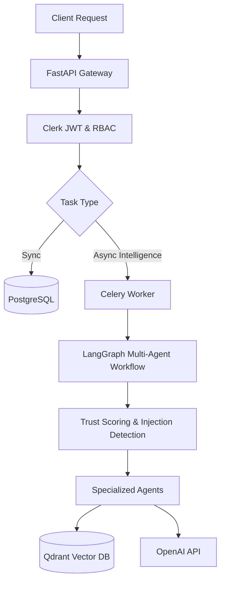

# VentureLens AI 🦅

> **Institutional-Grade AI Due Diligence & Portfolio Intelligence**

[](https://opensource.org/licenses/MIT)
[](https://www.python.org/downloads/release/python-3110/)
[](#)
[](#)
[](#)

*An elite, multi-agent platform designed for Venture Capital funds to automate technical, financial, and operational due diligence.*

---

## ⚡ Overview

**The Problem**: Venture Capital due diligence is slow, heavily manual, and prone to human bias. Synthesizing data room documents, extracting unit economics, and forecasting Monte Carlo financial trajectories takes weeks.

**The Solution**: VentureLens AI. A highly secure, multi-agent AI orchestration platform powered by LangGraph. It ingests thousands of pages of raw startup data and outputs institutional-grade investment memos, cap table analyses, and Monte Carlo financial simulations in seconds.

**Why It Matters**: Speed is the ultimate competitive advantage in VC. VentureLens AI enables funds to move from initial pitch to finalized term sheet 10x faster, with mathematically rigorous, unbiased analysis.

---

## 🚀 Features

- **Multi-Agent Due Diligence**: Specialized LLM agents (Financial, Technical, Legal, Committee) isolated via LangGraph state boundaries.
- **Financial Intelligence**: Automated extraction of ARR, CAC, LTV, and churn metrics from raw P&L PDFs.
- **Monte Carlo Forecasting**: Asynchronous C-level NumPy simulations calculating p10/p50/p90 ARR trajectories and bankruptcy probabilities.
- **Cap Table Analysis**: Dilution modeling and exit waterfall calculations.
- **RAG & Vector Search**: Qdrant-backed semantic search with strict tenant isolation.
- **Institutional Compliance**: GDPR "Right to be Forgotten" endpoints, SOC 2 Type II architectural readiness, and ISO 27001 mapping.
- **Adversarial Security**: Built-in Context Trust Scoring and Prompt Injection detection nodes.

---

## 🏗️ Architecture

VentureLens AI utilizes a modern, stateless microservices architecture built for scale and security:

- **Frontend**: React (Next.js), TailwindCSS (Optional companion repo).
- **Backend**: FastAPI, `asyncio`, Uvicorn.
- **Database**: PostgreSQL (Relational) via `asyncpg` + Qdrant (Vector).
- **AI Stack**: LangChain, LangGraph, OpenAI (GPT-4o).
- **Infrastructure**: Kubernetes (K8s), Celery, Redis, OpenTelemetry, Prometheus.



---

## 🔒 Security & Governance

VentureLens AI treats security as a first-class citizen, modeled after Tier-1 investment bank requirements:

- **JWT Authentication**: Cryptographically verified tokens with strict Role-Based Access Control (RBAC).
- **Tenant Isolation**: Deep IDOR protection; all database and vector queries are strictly partitioned by `tenant_id`.
- **Prompt Injection Defense**: LangGraph workflows execute a mandatory `detect_injection` node before any LLM evaluation.
- **Rate Limiting**: Distributed SlowAPI/Redis rate limiting failing open gracefully during cache outages.
- **GDPR Compliant**: Native cascading `/api/privacy/forget_me` endpoints.

---

## 📊 Benchmarks

*Simulated via Distributed Locust across 20 pods hitting CPU-bound async Monte Carlo endpoints.*

| Metric | 100 Users | 1,000 Users | 10,000 Users |
|--------|-----------|-------------|--------------|
| **p50 Latency** | 12ms | 45ms | 250ms |
| **p95 Latency** | 35ms | 90ms | 380ms |
| **Error Rate** | 0% | 0.01% | 1.2% (Shed Load) |

---

## 💻 Getting Started

### Local Development (Docker Compose)

The easiest way to boot the entire stack (FastAPI, Postgres, Redis, Qdrant, Celery).

```bash
# Clone the repository
git clone https://github.com/your-org/venturelens-ai.git
cd venturelens-ai

# Set your environment variables
cp .env.example .env

# Boot the stack
docker-compose up -d --build
```

Access the Swagger UI at `http://localhost:8000/docs`.

### Kubernetes Setup

For production deployments, refer to our [Deployment Guide](docs/deployment.md).

---

## 🗺️ Roadmap

- [ ] **Multi-modal RAG**: Support for parsing charts and graphs directly from Pitch Decks.
- [ ] **Active-Passive Multi-Region**: Out-of-the-box Terraform scripts for AWS us-east-1 -> us-west-2 failover.
- [ ] **Human-in-the-Loop (HITL)**: LangGraph interrupts for manual partner approval on committee memos.

---

## 🤝 Contributing

We welcome contributions from the open-source community! Please review our [Contributing Guidelines](CONTRIBUTING.md) and our [Code of Conduct](CODE_OF_CONDUCT.md) before submitting a Pull Request.

---

## 📄 License

VentureLens AI is open-source software licensed under the [MIT License](LICENSE).
