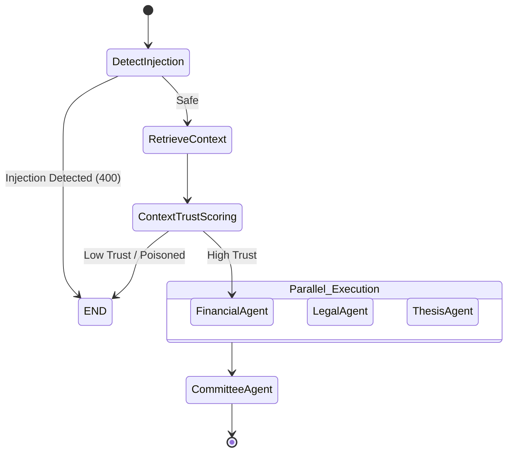

# AI Workflows & LangGraph

VentureLens AI replaces legacy sequential LLM chains (e.g., standard LangChain or CrewAI) with a highly secure, state-machine driven orchestration layer powered by LangGraph.

## State Machine Execution Flow

## Governance & Trust Boundaries
1. **Prompt Injection Node**: Before any internal evaluation begins, the payload is explicitly screened for override commands (e.g., "ignore previous instructions").
2. **Context Trust Node**: RAG-retrieved documents are evaluated for source verification. Unverified or structurally toxic data is rejected to prevent "RAG Poisoning."
3. **Agent Isolation**: Tools and system prompts are tightly scoped. The `FinancialAgent` has zero knowledge of the `LegalAgent`'s context until explicit state aggregation occurs at the `CommitteeAgent` level.
