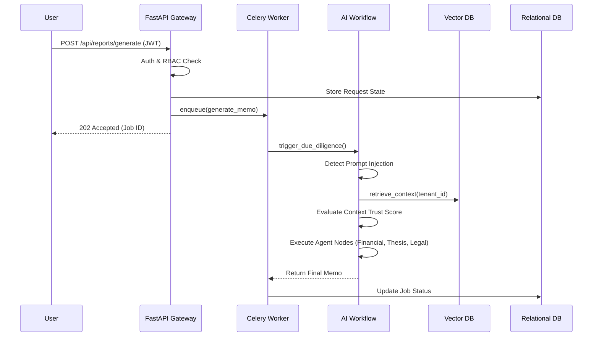

# System Architecture

VentureLens AI employs an event-driven, asynchronous microservices architecture to process massive streams of unstructured financial data with minimal latency.

## High-Level Data Flow

## Core Components

- **FastAPI Gateway**: Handles synchronous HTTP traffic, utilizing `asyncio.to_thread` for CPU-bound computations.
- **PostgreSQL**: Stores relational data, tenant states, and job tracking logic. Integrated via `asyncpg`.
- **Qdrant**: High-performance vector database utilized exclusively for semantic retrieval within the RAG pipeline.
- **Celery & Redis**: Redis acts as both the message broker for Celery and the cache for SlowAPI rate-limiting.
- **LangGraph Orchestrator**: Manages state transitions and strict trust boundaries between adversarial agents and internal analysis tools.
