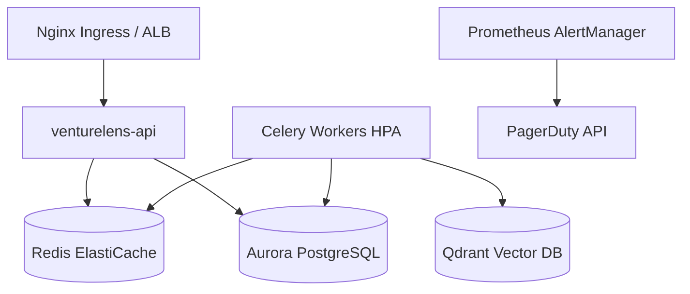

# Deployment Guide

VentureLens AI supports multiple deployment topologies, ranging from local development (Docker Compose) to full multi-region active-passive deployments.

## Local Development
For local testing, utilize the provided `docker-compose.yml`.

```bash
docker-compose up -d --build
```

## Production Kubernetes (EKS / GKE)

The repository contains standard manifesting patterns for Kubernetes deployments. 

### Architecture Topology



### Key Configurations
- **Horizontal Pod Autoscaling (HPA)**: Celery workers automatically scale based on queue depth.
- **Disaster Recovery**: A native Kubernetes `CronJob` (`postgres-s3-backup`) runs every hour, exporting `pg_dump` securely to an encrypted S3 bucket, ensuring a 1-hour Recovery Point Objective (RPO).
